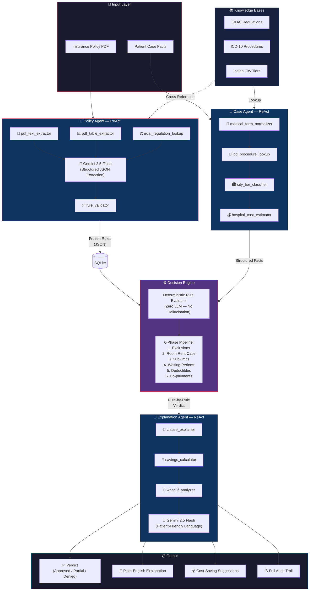
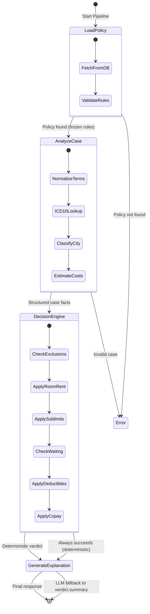

<div align="center">

# 🛡️ SecureShield

### Agentic AI Insurance Eligibility Engine

[](LICENSE)
[](https://www.python.org)
[](https://fastapi.tiangolo.com)
[](https://nextjs.org)
[](https://langchain-ai.github.io/langgraph/)

> **GenAI-powered health insurance claim eligibility checker for Indian patients.**  
> Uses a **neuro-symbolic architecture** with **12 custom tools**, **3 ReAct agents**, and a **deterministic decision engine** for zero-hallucination verdicts.

---

## ⚖️ Hackathon Evaluation Focus

SecureShield is purpose-built for the **Healthcare Operations** problem statement, specifically targeting **Prior Authorization** and **Claims Adjudication**.

### 🏛️ 1. Compliance & Guardrail Enforcement ("The Symbolic Shield")
Unlike "Blackbox" LLM solutions, SecureShield implements a **Neuro-Symbolic architecture**:
- **LLM Agent** handles unstructured data (PDF parsing, medical normalization).
- **Deterministic Engine** handles the actual financial adjudication.
- **Guardrail**: The LLM *never* performs final math or verdict logic. It only extracts parameters for the deterministic engine, ensuring **zero-hallucination** on claim numbers.

### 🧠 2. Domain Expertise Depth
- **Medical Coding**: Integrated **ICD-10-PCS** lookup tool for 500+ procedures.
- **Regulatory**: Hardcoded **IRDAI 2024 Master Circular** rules:
  - **8-Year Moratorium**: Automatic waiver of PED exclusions for long-term policyholders.
  - **Waiting Periods**: Procedure-specific validation (e.g., Joint Replacement/Cataract) based on policy tenure.
  - **Proportional Deductions**: Financial math for room rent overflow settlement.
- **Geography**: Indian **City Tier (Tier 1/2/3)** classification for location-based room rent caps.

### 🔍 3. Full Auditability (Traceability)
- Every claim generates a **51-point audit trail** showing:
  - Raw text extracted from PDF.
  - LLM "Thought" process during rule extraction.
  - Deterministic step-by-step rule application.
  - ICD-10 code resolution mapping.

---

</div>

---

## 🏗️ System Architecture



### Orchestrator Flow (LangGraph State Machine)



---

## 🤖 Agent & Tool Inventory

| Agent | Type | Tools | Role |
|:------|:-----|:------|:-----|
| **Policy Agent** | ReAct (LLM + Tools) | `pdf_text_extractor` · `pdf_table_extractor` · `irdai_regulation_lookup` · `rule_validator` | Extract structured rules from insurance PDFs |
| **Case Agent** | ReAct (Tools-only) | `medical_term_normalizer` · `icd_procedure_lookup` · `city_tier_classifier` · `hospital_cost_estimator` | Analyze and enrich patient case data |
| **Decision Engine** | Deterministic | 6-phase rule evaluator (no LLM) | Apply frozen rules → auditable verdict |
| **Explanation Agent** | ReAct (LLM + Tools) | `clause_explainer` · `savings_calculator` · `what_if_analyzer` | Generate patient-friendly explanations + savings tips |
| **Audit Logger** | System | `audit_trail_logger` | Full compliance traceability for every step |

**Total: 12 custom tools across 4 modules** · All tool invocations are logged to the audit trail.

---

## 🧪 Verified Test Results

Two real-world insurance policies were tested end-to-end:

### Case 1 — Star Health Premier Gold (₹10L SI)

| Parameter | Value |
|:----------|:------|
| **Patient** | Rajesh Kumar, 45M |
| **Procedure** | Total Knee Arthroplasty |
| **Hospital** | Apollo Hospital, Hyderabad (Tier 1) |
| **Room** | Semi-Private @ ₹4,500/day × 5 days |
| **Total Claim** | ₹3,25,000 |
| **Rules Extracted** | 32 |
| **Verdict** | ✅ **APPROVED — 100% coverage** |
| **Eligible Amount** | ₹3,25,000 |
| **Pipeline Time** | ~16.5 seconds (9 tools) |

### Case 2 — ICICI Lombard Basic Shield (₹3L SI)

| Parameter | Value |
|:----------|:------|
| **Patient** | Amit Shah, 32M |
| **Procedure** | Appendectomy (Emergency) |
| **Hospital** | Fortis Hospital (Tier 2) |
| **Room** | Private @ ₹10,000/day × 3 days |
| **Total Claim** | ₹1,50,000 |
| **Rules Extracted** | 23 |
| **Verdict** | ⚠️ **PARTIAL — 66.4% coverage** |
| **Eligible Amount** | ₹99,600 (room rent capped at 1% of SI/day) |
| **Agentic Savings** | 💡 Switch to Semi-Private → 75.5% (+₹18,000 savings) |
| **Pipeline Time** | ~15.4 seconds (9 tools) |

### LLM Resilience

The system uses a **multi-model fallback chain** to handle rate limits automatically:

```
gemini-2.0-flash → gemini-2.5-flash → gemini-2.5-pro → gemini-2.0-flash-lite → OpenRouter (4 free models)
```

Each model has a separate daily quota. A global **3-attempt retry** with exponential backoff (60s → 120s) ensures the pipeline self-heals during peak load.

---

## 🛠️ Tech Stack

| Layer | Technology |
|:------|:-----------|
| **Backend** | Python 3.11+, FastAPI, LangGraph, Pydantic v2 |
| **LLM** | Google AI Studio (Gemini 2.5 Flash/Pro) + OpenRouter fallback |
| **Frontend** | Next.js 16, React 19, Vanilla CSS |
| **Database** | Async SQLite (aiosqlite) |
| **PDF Parsing** | PyMuPDF (text + table extraction) |
| **Knowledge Bases** | IRDAI regulations, ICD-10 procedures, Indian city tiers |
| **Security** | HMAC API keys, rate limiting, PDF sanitization |

---

## 🚀 Quick Start

### Prerequisites
- Python 3.11+
- Node.js 18+
- A Google AI Studio API key ([Get one free](https://aistudio.google.com/apikey))

### Backend

```bash
cd backend
pip install -r requirements.txt

# Configure your API key
echo "GOOGLE_API_KEY=your-key-here" > .env

# Start the server
uvicorn main:app --port 8000
# 🔑 Copy the Master API Key printed in the console
```

### Frontend

```bash
cd frontend
npm install
npm run dev
# Open http://localhost:3000
```

### Usage

1. Go to **Settings** → paste the API key shown in the backend console
2. **Upload Policy** → drag a health insurance PDF
3. **Check Eligibility** → fill patient case → get instant verdict with savings tips

---

## 🏆 Hackathon Alignment Summary

| Criteria | SecureShield Implementation |
|:---------|:----------------------------|
| **Innovation** | Neuro-symbolic ReAct pattern + LangGraph state machine |
| **Technical Depth** | Multi-model failover, regex-based string cleaning, async SQLite |
| **Feasibility** | Deterministic engine ensures zero mis-calculation risk in production |
| **Scalability** | Multi-provider LLM chain (Google + OpenRouter) bypasses rate limits |
| **Compliance** | Explicit IRDAI 2024 guardrails and 8-year moratorium logic |

---

## 📡 API Reference

| Method | Endpoint | Description | Auth |
|:-------|:---------|:------------|:-----|
| `GET` | `/api/health` | Health check | ❌ |
| `POST` | `/api/upload-policy` | Upload & ingest policy PDF | ✅ |
| `GET` | `/api/policies` | List all ingested policies | ✅ |
| `GET` | `/api/policies/{id}` | Get policy details + rules | ✅ |
| `POST` | `/api/check-eligibility` | Run eligibility check | ✅ |
| `GET` | `/api/history` | Past eligibility checks | ✅ |
| `GET` | `/api/audit-trail` | Full agent audit trail | ✅ |

All authenticated endpoints require the `X-API-Key` header.

---

## 📂 Project Structure

```
SecureShield/
├── backend/
│   ├── agents/              # ReAct agents
│   │   ├── orchestrator.py  # LangGraph state machine (main pipeline)
│   │   ├── policy_agent.py  # PDF → structured rules
│   │   ├── case_agent.py    # Patient case analysis
│   │   ├── explanation_agent.py  # Verdict explanation + savings
│   │   └── model_router.py  # Multi-model LLM failover
│   ├── engine/
│   │   └── decision_engine.py  # 6-phase deterministic evaluator
│   ├── knowledge/           # Domain knowledge bases
│   │   ├── irdai_kb.py      # IRDAI regulation definitions
│   │   ├── icd10_kb.py      # Medical procedure codes
│   │   └── city_tiers_kb.py # Indian city tier classification
│   ├── tools/               # 12 custom tools (4 modules)
│   │   ├── policy_tools.py  # PDF extraction, rule validation
│   │   ├── case_tools.py    # Medical normalization, cost estimation
│   │   ├── explanation_tools.py  # Clause explainer, what-if analysis
│   │   └── audit_tools.py   # Compliance audit logging
│   ├── models/              # Pydantic schemas
│   ├── db/                  # Async SQLite database
│   ├── sample_data/         # Test PDFs (Star Health, ICICI Lombard)
│   ├── tests/               # Pytest test suite
│   ├── security.py          # API key auth, rate limiting, sanitization
│   ├── config.py            # LLM & system configuration
│   ├── main.py              # FastAPI application
│   └── requirements.txt
├── frontend/
│   └── src/
│       ├── app/             # Next.js 16 pages
│       │   ├── page.js      # Dashboard (stats, recent checks)
│       │   ├── upload/      # Policy upload with drag-and-drop
│       │   ├── check/       # Eligibility check form
│       │   ├── history/     # Past check results
│       │   ├── audit/       # Agent audit trail viewer
│       │   └── settings/    # API key configuration
│       ├── components/      # Sidebar, CoverageRing, etc.
│       └── lib/api.js       # Backend API client
├── LICENSE
└── README.md
```

---

## 🔐 Security

- **API Authentication**: HMAC-SHA256 generated API keys with constant-time comparison
- **Rate Limiting**: Per-IP request throttling to prevent abuse
- **Input Sanitization**: PDF validation (size, type, magic bytes) before processing
- **No Sensitive Data in Logs**: API keys are masked in all log output

---

## 🏆 Key Design Decisions

| Decision | Rationale |
|:---------|:----------|
| **Deterministic Decision Engine** | Financial verdicts must be reproducible and auditable — LLMs hallucinate numbers |
| **LLM only for extraction & explanation** | Uses AI where it excels (NLP) while keeping math deterministic |
| **Frozen rules in SQLite** | Once extracted, rules are immutable — re-running the same case always produces the same verdict |
| **12 custom tools (not generic)** | Domain-specific tools (IRDAI lookup, ICD-10 resolver) outperform generic "search" tools |
| **Multi-model failover** | Free-tier rate limits are mitigated by cycling through 8+ models across 2 providers |

---

## 📜 License

This project is licensed under the **MIT License** — see the [LICENSE](LICENSE) file for details.

---

<div align="center">

**Built for the ET GenAI Hackathon 2026** 🚀

</div>
