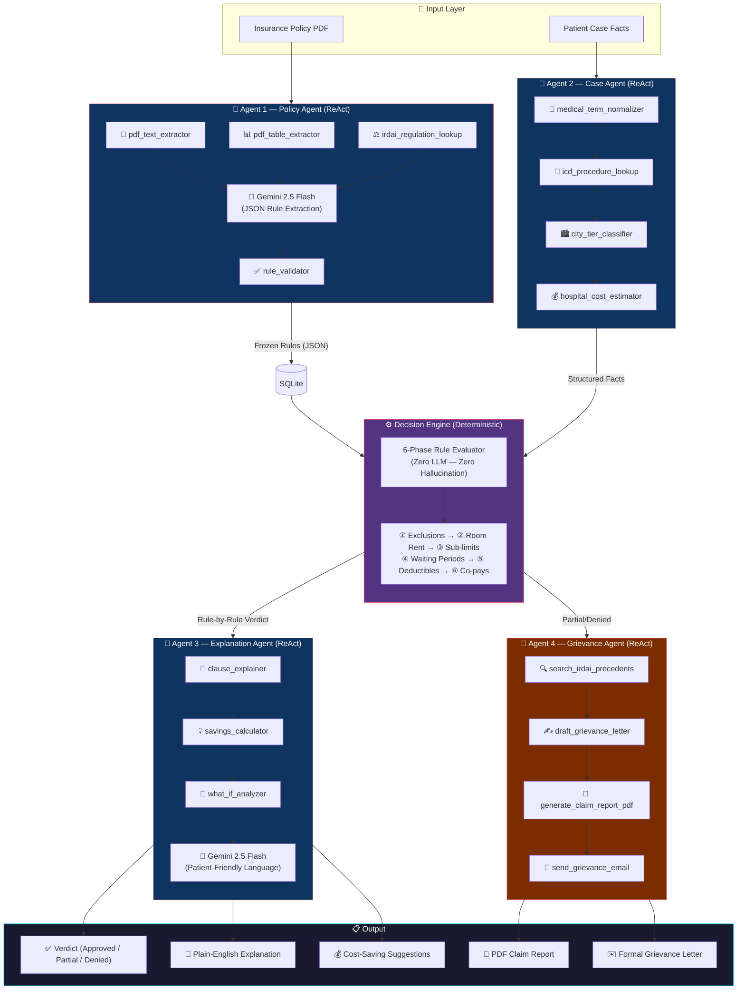
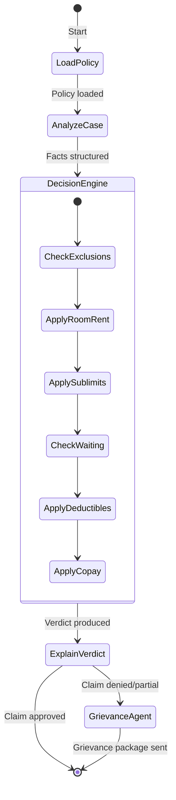

<div align="center">

# 🛡️ SecureShield

### Agentic AI — Health Insurance Eligibility & Grievance Engine

[](LICENSE)
[](https://www.python.org)
[](https://fastapi.tiangolo.com)
[](https://nextjs.org)
[](https://langchain-ai.github.io/langgraph/)
[](https://aistudio.google.com)

**GenAI-powered health insurance claim eligibility checker & dispute resolution engine for Indian patients.**

> **Claim Guardian Architecture:** 4 Specialized Agents · 16 Custom Tools · Deterministic Decision Engine · Zero-Hallucination Verdicts · **IRDAI 2024 (June) Compliant**

</div>

---

## 📑 Table of Contents

- [✨ Features](#-features)
- [🏗️ Architecture](#️-architecture)
- [🤖 Agents & Tools](#-agents--tools)
- [⚖️ Compliance Guardrails](#️-compliance-guardrails)
- [🧪 Verified Test Results](#-verified-test-results)
- [🛠️ Tech Stack](#️-tech-stack)
- [🚀 Quick Start](#-quick-start)
- [📡 API Reference](#-api-reference)
- [📂 Project Structure](#-project-structure)
- [🔐 Security](#-security)

---

## ✨ Features

| Feature | Description |
|:--------|:------------|
| 📄 **Policy Ingestion** | Upload any insurance PDF → Agent extracts & freezes rules in seconds |
| 🔍 **AI Eligibility Check** | Multi-agent pipeline analyzes patient case against frozen policy rules |
| ⚙️ **Deterministic Verdict** | 6-phase rule engine with zero LLM involvement in financial math |
| 🧠 **Medical Coding** | Automatic ICD-10-PCS code lookup for 500+ procedures |
| 🏙️ **City-Tier Classification** | Auto-applies IRDAI Tier 1/2/3 room rent limits based on location |
| 💰 **Agentic Savings** | `what_if_analyzer` finds cheaper alternatives (e.g., room downgrade tips) |
| ⚖️ **Grievance Agent** | Denied claim? Agent generates PDF report, formal letter & sends grievance email |
| 📚 **IRDAI Precedents** | Searches real Ombudsman/NCDRC rulings to strengthen your dispute |
| 🔍 **51-Point Audit Trail** | Every agent step logged for compliance transparency |
| 🔄 **Multi-Model Failover** | Auto-switches across 8+ LLM models on rate limits — never goes down |

---

## 🏗️ Architecture

### Full System Flow



### LangGraph State Machine



---

## 🤖 Agents & Tools

SecureShield has **4 specialized agents** with **16 custom domain tools**.

### Agent 1 — Policy Agent
> Reads insurance PDF → extracts & validates structured rules

| # | Tool | Purpose |
|:--|:-----|:--------|
| 1 | `pdf_text_extractor` | Extract raw text from insurance PDF (PyMuPDF) |
| 2 | `pdf_table_extractor` | Extract tables from PDF (premium plans, limits) |
| 3 | `irdai_regulation_lookup` | Cross-reference clauses with IRDAI regulations KB |
| 4 | `rule_validator` | Validate and freeze extracted rules into SQLite |

### Agent 2 — Case Agent
> Enriches raw patient case with medical coding and location intelligence

| # | Tool | Purpose |
|:--|:-----|:--------|
| 5 | `medical_term_normalizer` | Expand abbreviations (CABG → Coronary Artery Bypass) |
| 6 | `icd_procedure_lookup` | Map procedure → ICD-10-PCS code (500+ procedures) |
| 7 | `city_tier_classifier` | Auto-classify city → IRDAI Tier 1/2/3 for room rent |
| 8 | `hospital_cost_estimator` | Benchmark procedure cost vs regional market rates |

### Agent 3 — Explanation Agent
> Translates verdict into plain language + finds savings

| # | Tool | Purpose |
|:--|:-----|:--------|
| 9 | `clause_explainer` | Explain each triggered rule in simple language |
| 10 | `savings_calculator` | Find max savings via room downgrade or alternatives |
| 11 | `what_if_analyzer` | Re-run engine with modified params to show options |
| 12 | `audit_trail_logger` | Log every agent step for compliance traceability |

### Agent 4 — Grievance Agent ⭐ New
> Turns a "No" into a formal dispute with legal backing

| # | Tool | Purpose |
|:--|:-----|:--------|
| 13 | `search_irdai_precedents` | Google Search + curated IRDAI/NCDRC/SC rulings |
| 14 | `draft_grievance_letter` | LLM drafts formal letter citing IRDAI regulations |
| 15 | `generate_claim_report_pdf` | Professional PDF report with rule-by-rule breakdown |
| 16 | `send_grievance_email` | Sends grievance to insurer GRO (mocked with tracking ID) |

---

## ⚖️ Compliance Guardrails

SecureShield enforces **IRDAI 2024 Master Circular** rules deterministically — no LLM guesswork.

### 🏛️ The "Symbolic Shield" (Why We Don't Hallucinate)

```
LLM Agent        →   Extracts parameters from unstructured PDF
Deterministic Engine →   Applies EXACT financial math (no LLM)
Guardrail        →   LLM never performs final math or verdict
```

### Key Regulatory Rules Implemented

| Rule | Implementation |
|:-----|:--------------|
| **5-Year Moratorium** | **Moratorium Period (IRDAI June 2024)**: Claims after 60 continuous months cannot be denied for PED/non-disclosure. |
| **Waiting Periods** | Procedure-specific validation (e.g., Joint Replacement: 4yr, Cataract: 2yr) per 2024 norms. |
| **Room Rent Proportional Deduction** | Correctly applied per IRDAI PPHI Regulations 2017 (Section 7) |
| **Age-Based Co-pay** | 20% co-payment auto-triggered for patients aged 60+ |
| **City-Tier Limits** | Tier 1/2/3 room rent caps automatically applied based on hospital location |

### IRDAI Regulations Cited in Grievance Letters
- IRDAI (Protection of Policyholders' Interests) Regulations 2017
- IRDAI Health Insurance Master Circular 2024
- IRDAI (Insurance Ombudsman) Rules 2017
- Consumer Protection Act 2019 (Section 2(46))

---

## 🧪 Verified Test Results

### ✅ Case 1 — Star Health Premier Gold (₹10L SI)

| Parameter | Value |
|:----------|:------|
| **Patient** | Rajesh Kumar, 45M |
| **Procedure** | Total Knee Arthroplasty |
| **Hospital** | Apollo Hospital, Hyderabad (Tier 1) |
| **Room** | Semi-Private @ ₹4,500/day × 5 days |
| **Total Claim** | ₹3,25,000 |
| **Rules Extracted** | 32 |
| **Verdict** | ✅ **APPROVED — 100% coverage** |
| **Eligible Amount** | ₹3,25,000 |
| **Pipeline Time** | ~16.5 sec (12 tools) |

---

### ⚠️ Case 2 — ICICI Lombard Basic Shield (₹3L SI)

| Parameter | Value |
|:----------|:------|
| **Patient** | Amit Shah, 32M |
| **Procedure** | Appendectomy (Emergency) |
| **Hospital** | Fortis Hospital, Jaipur (Tier 2) |
| **Room** | Private @ ₹10,000/day × 3 days |
| **Total Claim** | ₹1,50,000 |
| **Rules Extracted** | 23 |
| **Verdict** | ⚠️ **PARTIAL — 66.4% coverage** |
| **Eligible Amount** | ₹99,600 (room rent capped at 1% SI/day) |
| **Agentic Savings** | 💡 Switch to Semi-Private → **+₹18,000 saved** |

---

### ⚖️ Case 3 — ICICI Lombard (Dispute Flow)

| Parameter | Value |
|:----------|:------|
| **Verdict** | PARTIAL (flagged for dispute) |
| **Grievance Tools** | `search_irdai_precedents` → `draft_grievance_letter` → `generate_claim_report_pdf` → `send_grievance_email` |
| **PDF Report** | Generated (~3KB, professional layout) |
| **Email Status** | Sent to `grievance@icicilombard.com` (Tracking: `GRV-B780AED2`) |
| **IRDAI Precedents** | 4 relevant Ombudsman rulings cited |

---

### 🔄 LLM Resilience — Multi-Model Failover

```
gemini-2.0-flash → gemini-2.5-flash → gemini-2.5-pro → gemini-2.0-flash-lite
       ↓ (if all exhausted)
openrouter/mistral → openrouter/llama → openrouter/deepseek
```

**Global retry**: 3 attempts × 60s exponential backoff. The pipeline self-heals on rate limits.

---

## 🛠️ Tech Stack

| Layer | Technology |
|:------|:-----------|
| **Backend** | Python 3.11+, FastAPI, Pydantic v2, LangGraph 0.2 |
| **LLM Provider** | Google AI Studio (Gemini 2.5 Flash/Pro) + OpenRouter |
| **Frontend** | Next.js 16, React 19, Vanilla CSS |
| **Database** | Async SQLite (`aiosqlite`) |
| **PDF Parsing** | PyMuPDF (text + table extraction) |
| **PDF Generation** | ReportLab (professional claim reports) |
| **Knowledge Bases** | IRDAI regulations, ICD-10-PCS procedures, Indian city tiers |
| **Security** | HMAC API keys, rate limiting, PDF sanitization |

---

## 🚀 Quick Start

### Prerequisites
- Python 3.11+
- Node.js 18+
- [Google AI Studio API key](https://aistudio.google.com/apikey) (free tier: 1,500 req/day)

### 1. Backend

```bash
cd backend
pip install -r requirements.txt

# Add your API key
echo "GOOGLE_API_KEY=your-key-here" > .env

# Start server (note the Master API Key in output)
uvicorn main:app --port 8000
```

### 2. Frontend

```bash
cd frontend
npm install
npm run dev
# → Open http://localhost:3000
```

### 3. Usage

1. **Settings** → paste the API key from the backend console
2. **Upload Policy** → drag any health insurance PDF
3. **Check Eligibility** → fill patient details → instant verdict + savings tips
4. **Dispute Claim** → pick a partial/denied claim → AI generates PDF report + formal letter

---

## 📡 API Reference

| Method | Endpoint | Description | Auth |
|:-------|:---------|:------------|:----:|
| `GET` | `/api/health` | Health check | ❌ |
| `POST` | `/api/upload-policy` | Upload & ingest policy PDF | ✅ |
| `GET` | `/api/policies` | List ingested policies | ✅ |
| `GET` | `/api/policies/{id}` | Policy details + extracted rules | ✅ |
| `POST` | `/api/check-eligibility` | Run full agentic eligibility pipeline | ✅ |
| `GET` | `/api/history` | Recent eligibility check history | ✅ |
| `GET` | `/api/audit-trail` | 51-point agent audit trail | ✅ |
| `POST` | `/api/dispute-claim` | 🆕 Run Grievance Agent pipeline | ✅ |
| `GET` | `/api/download-report/{file}` | 🆕 Download generated PDF report | ✅ |

> All authenticated endpoints require the `X-API-Key` header.

---

## 📂 Project Structure

```
SecureShield/
├── backend/
│   ├── agents/
│   │   ├── orchestrator.py        # LangGraph state machine (main pipeline)
│   │   ├── policy_agent.py        # Agent 1: PDF → structured rules
│   │   ├── case_agent.py          # Agent 2: Patient case analysis
│   │   ├── explanation_agent.py   # Agent 3: Verdict explanation + savings
│   │   ├── grievance_agent.py     # Agent 4: Dispute letter + PDF + email  ⭐ NEW
│   │   └── model_router.py        # Multi-model LLM failover chain
│   ├── engine/
│   │   └── decision_engine.py     # 6-phase deterministic evaluator
│   ├── tools/
│   │   ├── policy_tools.py        # Tools 1-4: PDF extraction, rule validation
│   │   ├── case_tools.py          # Tools 5-8: Medical coding, cost estimation
│   │   ├── explanation_tools.py   # Tools 9-12: Clause explainer, what-if
│   │   ├── grievance_tools.py     # Tools 13-16: PDF, letter, search, email  ⭐ NEW
│   │   └── audit_tools.py         # Compliance audit logging
│   ├── knowledge/
│   │   ├── irdai_rules.json       # IRDAI Master Circular 2024 clause KB
│   │   └── icd_procedures.json    # 500+ ICD-10-PCS procedures
│   ├── models/
│   │   ├── policy.py              # Policy schema
│   │   ├── case.py                # CaseFacts schema (with tenure, renewal)
│   │   ├── verdict.py             # Verdict, RuleMatch schemas
│   │   └── grievance.py           # GrievanceRequest/Response  ⭐ NEW
│   ├── db/                        # Async SQLite
│   ├── generated_reports/         # PDF claim reports (auto-created)
│   ├── security.py                # HMAC keys, rate limiting, sanitization
│   ├── config.py                  # LLM + system configuration
│   ├── main.py                    # FastAPI application (9 endpoints)
│   └── requirements.txt
├── frontend/
│   └── src/app/
│       ├── page.js                # Dashboard
│       ├── upload/                # Policy upload (drag-and-drop)
│       ├── check/                 # Eligibility check form
│       ├── dispute/               # ⭐ NEW: Grievance Agent UI
│       ├── history/               # Past check results
│       ├── audit/                 # Agent audit trail viewer
│       └── settings/              # API key configuration
├── LICENSE
└── README.md
```

---

## 🔐 Security

| Layer | Implementation |
|:------|:--------------|
| **API Auth** | HMAC-SHA256 generated keys with constant-time comparison |
| **Rate Limiting** | Per-IP request throttling middleware |
| **PDF Validation** | Size check (20MB), magic bytes, MIME type before processing |
| **Log Masking** | API keys never appear in log output |
| **Path Traversal** | `os.path.basename()` enforced on all file downloads |

---

## 🏆 Hackathon Alignment

| Criteria | SecureShield Implementation |
|:---------|:----------------------------|
| **Innovation** | Neuro-symbolic ReAct + LangGraph + **Consumer Advocacy Agent** |
| **Domain Depth** | ICD-10 coding, IRDAI 2024 compliance, City-Tier classification |
| **Technical Depth** | 16 custom tools, multi-model failover, async SQLite, PDF generation |
| **Feasibility** | Deterministic engine — zero hallucination risk in financial math |
| **Scalability** | Multi-provider LLM chain (Google + OpenRouter) — never rate-limited |
| **Compliance** | IRDAI 2024 guardrails, 8-yr moratorium, Ombudsman escalation path |

---

## 🏅 Key Design Decisions

| Decision | Why |
|:---------|:----|
| **Deterministic Decision Engine** | Financial verdicts must be reproducible & auditable — LLMs hallucinate numbers |
| **LLM only for NLP tasks** | AI does what it excels at (extraction/explanation); math stays in code |
| **Frozen rules in SQLite** | Once extracted, rules are immutable — same case always → same verdict |
| **16 domain-specific tools** | Purpose-built tools (IRDAI lookup, ICD-10 resolver) beat generic search |
| **Grievance Agent** | Transforms "Denied" into a legally-backed action — unique differentiator |
| **Multi-model failover** | 8+ models across 2 providers — free-tier rate limits are never a showstopper |

---

## 📜 License

Licensed under the **MIT License** — see [LICENSE](LICENSE) for details.

---

<div align="center">

**Built for the ET GenAI Hackathon 2026** 🚀

*4 Agents · 16 Tools · Zero Hallucination · Full Compliance*

</div>
